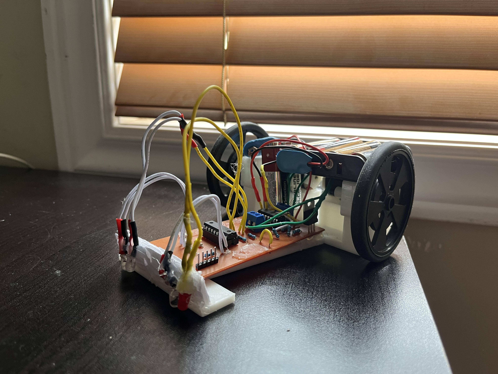

# line_follower
A line follower robot built completely at home.

### How is it built?
This line follower robot features two GM2 motors, a homemade PCB powered by a PIC16F628A chip, and a 3d printed chasis. For more information, please refer to the video. Everything that I used (3d object, schematic, PCB layout, etc) are attached here. Feel free to try and make it yourself if you have the materials!

### demo
youtube link: https://youtu.be/eucNkGSRyUw
Coming Soon: Tutorial on how to make professional PCB's at home.
